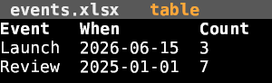
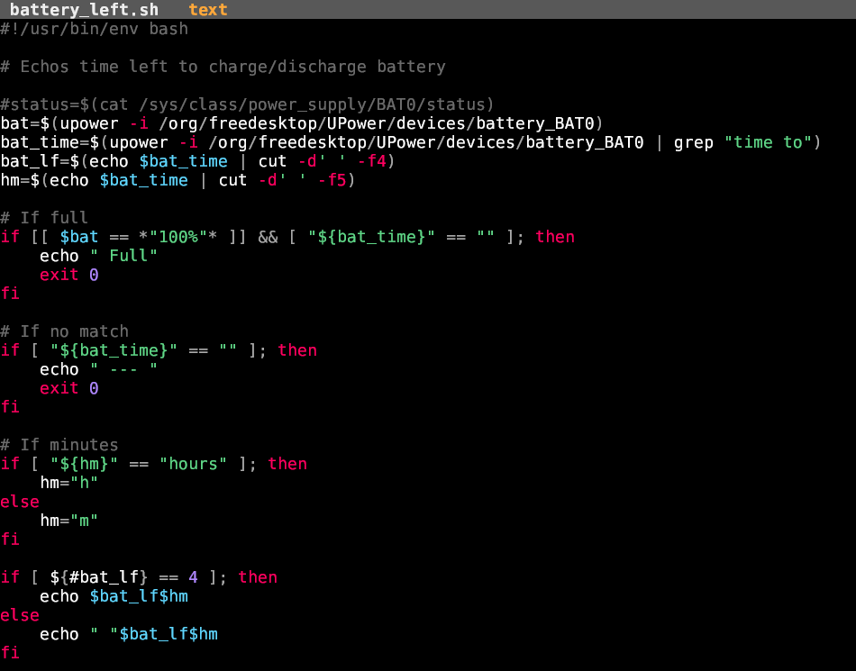
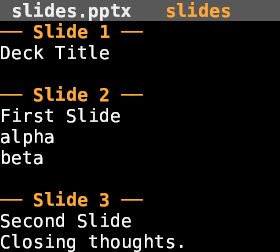

# viewer



    

A universal read-only file viewer for the terminal. Point it at almost any file
— spreadsheet, document, slide deck, PDF, image, code — and it renders a clean
preview, then launches the right editor on a keypress. Part of the
[Fe2O3](https://github.com/isene/fe2o3) Rust terminal suite.

<br clear="left"/>

## The idea

One viewer for everything LibreOffice-shaped, plus text, code and images. It
detects the file type and renders it read-only with the right method — calamine
for tables, pandoc for documents, pdftotext for PDFs, syntax highlighting for
code, inline images via kitty/sixel — then hands off to an editor when you want
to change something. Formats live in a small config table, so adding one is a
line, not a recompile.

## Screenshots






## Features

- **Tables** — csv/tsv, xlsx/ods (calamine); aligned columns, Excel dates as
  `YYYY-MM-DD`.
- **Documents** — docx/odt via pandoc.
- **Slides** — pptx/odp text outline with per-slide dividers.
- **PDF** — pdftotext.
- **Images** — rendered **inline** via [glow](https://github.com/isene/glow)
  (kitty / sixel).
- **Code & text** — syntax-highlighted with
  [highlight](https://github.com/isene/highlight) (18 languages plus Markdown,
  HyperList, LaTeX).
- **Launches the right editor** — `e` opens grid / scribe / `$EDITOR` per type;
  `x` opens with the system default (xdg-open).
- **Browse** — `o` (or launching with no file) opens
  [pointer](https://github.com/isene/pointer) as the file picker.
- Config-driven and extensible via `~/.config/viewer/handlers.conf`.

## Install

```bash
# From a release (Linux/macOS, x86_64/aarch64)
chmod +x viewer-* && sudo cp viewer-linux-x86_64 /usr/local/bin/viewer

# Or build from source (needs the sibling crust/glow/highlight crates alongside)
for r in crust glow highlight viewer; do git clone https://github.com/isene/$r; done
cd viewer && cargo build --release
```

## Usage

```bash
viewer report.docx
viewer data.xlsx
viewer photo.png
viewer              # no file → browse with pointer
```

## Keys

| Key | Action |
|-----|--------|
| `j k` / arrows | scroll |
| `g` `G` | top / bottom |
| `PgUp` `PgDn` | page |
| `e` `Enter` | edit — launch the right editor |
| `x` | open externally (xdg-open) |
| `o` | browse files (pointer) |
| `?` | help |
| `q` | quit |

## Configuring formats

`~/.config/viewer/handlers.conf` — one line per extension:

```
# ext   kind    edit-command
pptx    slides  -
epub    doc     scribe
ini     text    $EDITOR
```

`kind` is one of `table` / `text` / `doc` / `slides` / `pdf` / `image` / `hex`;
`-` means view-only; the edit-command can be `xdg-open` to defer to the system
default.

## Part of Fe2O3

viewer is one tool in the [Fe2O3](https://github.com/isene/fe2o3) suite of fast
Rust terminal apps. It builds on [crust](https://github.com/isene/crust),
[glow](https://github.com/isene/glow) and
[highlight](https://github.com/isene/highlight), launches
[grid](https://github.com/isene/grid) for spreadsheets, and uses
[pointer](https://github.com/isene/pointer) to browse.

## License

Public domain ([Unlicense](https://unlicense.org)).
